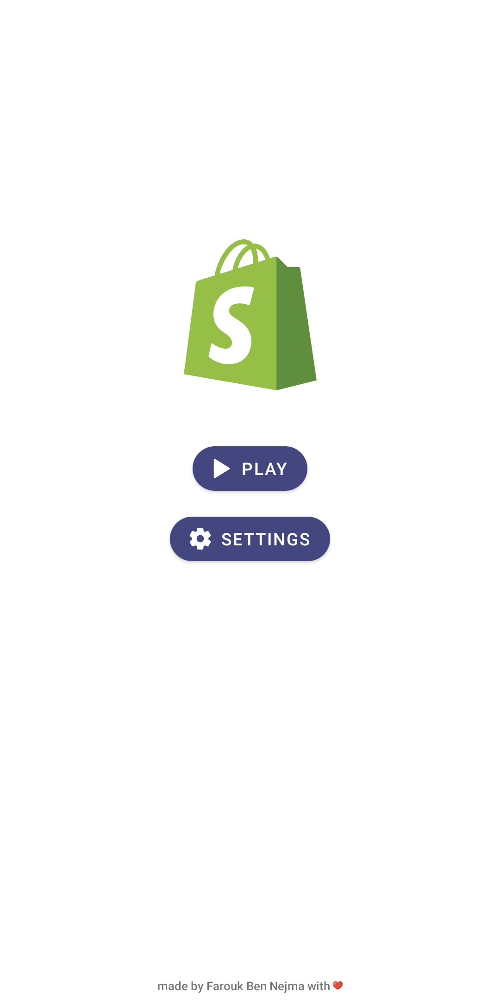
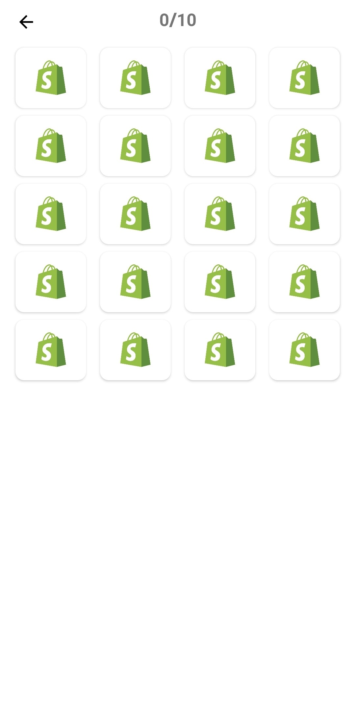
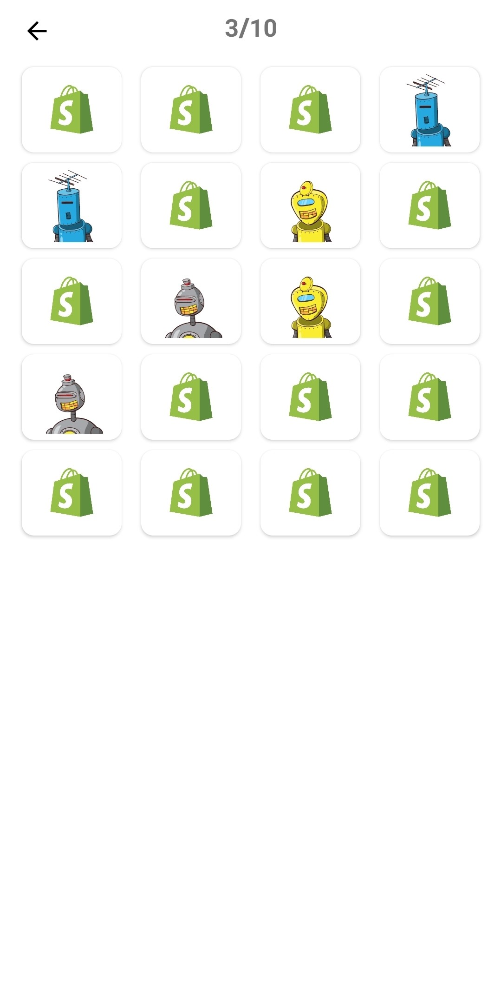
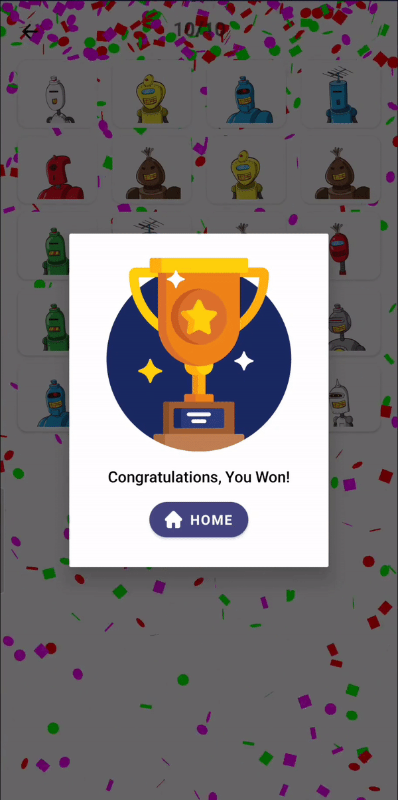
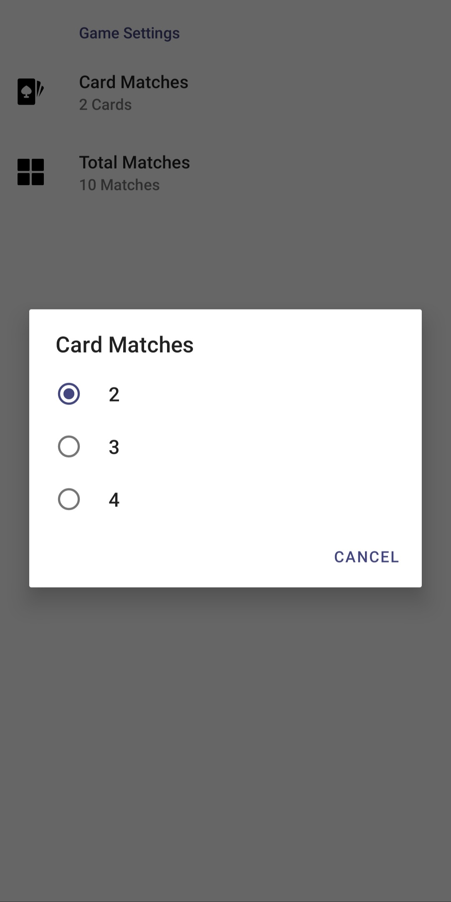
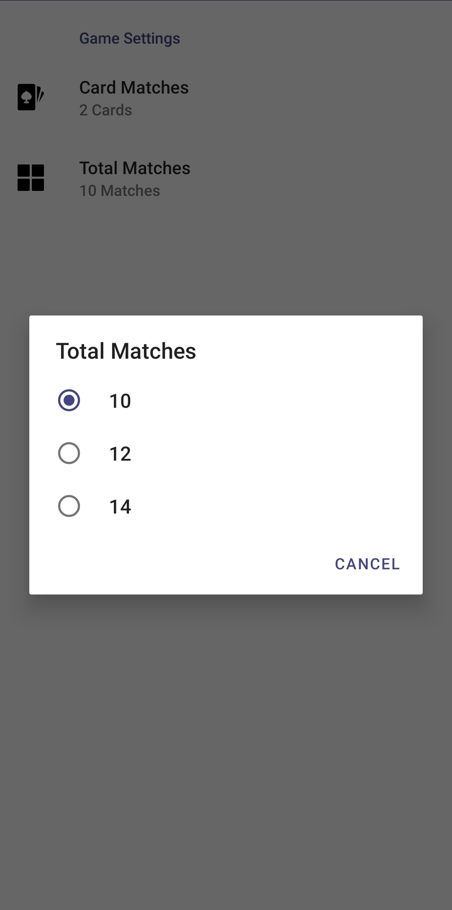

# Shopify Mobile Developer Matching Game :video_game:
This is my submission for the Mobile Developer Intern (Android) Positon - Fall 2020 :fire:

>Your challenge is to create a memory matching mobile app for Android or iOS (depending on the discipline you’re applying to) using the below JSON endpoint

	 https://shopicruit.myshopify.com/admin/products.json?page=1&access_token=c32313df0d0ef512ca64d5b336a0d7c6

## My approach :sunglasses:

For this challenge I used Kotlin as a programming language. I also tried to follow the Separation of Concerns design principle while implemeting the MVVM structure and Android Jetpack Library. 

## Design :dancer:

For the UI of the app I went with a clean minimalist design and used Google material design components.
|  Home Screen :house:| Settings Screen :gear: |
|--|--|
|  |  |

## Screenshots :iphone:	
>What you need to submit within your GitHub Repo:
>1.  A screenshot of your app when no matches are made.
>2.  A screenshot of your app when some matches are made.  
>3.  A screenshot of your app when the user wins.

|  No matches :worried: |Some matches :neutral_face: |User wins :grinning: |
|--|--|--|
|  |  | | 

## Requirements :dart:	
All the requirements have been completed :heavy_check_mark:
 - [x] The user should have to find a minimum of 10 pairs to win.
 - [x] Keep track of how many pairs the user has found.
 - [x] When the user wins, display a message to let them know!
 - [x] Make sure it compiles successfully.

## Bonus :star:	
>1.  Make the game configurable to match 3 or 4 of the same products instead of 2.
>2.  Make the grid size configurable. (The player needs to match more than 10 sets of the same product).

I implemented the above bonus features in the Game settings screen. To implement this screen I used the Android Jetpack Preference Library.

| Game configuration | Grid size configuration  |
|--|--|
|  |  |

## Libraries :books:	
|Library| Used for  |
|--|--|
|Jetpack :rocket:| For MVVM structure|
|Retrofit| For requesting the Shopify products API |
|Glide| For image loading and caching for Shopify product image URLS |
|Kodein| For depedency injection  |
|Konfetti :tada:| For winning dialog confetti explosion |

## Gameplay :movie_camera:

This is a recording showing the game being played.

